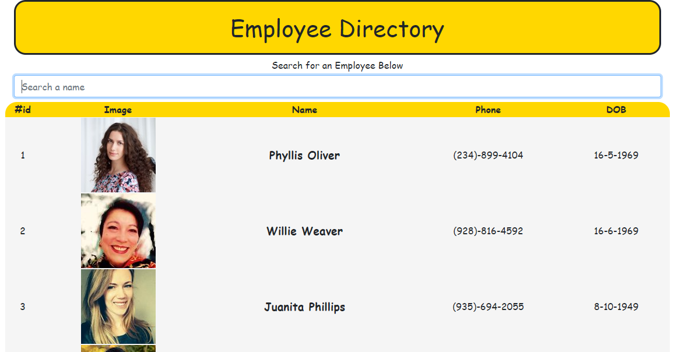
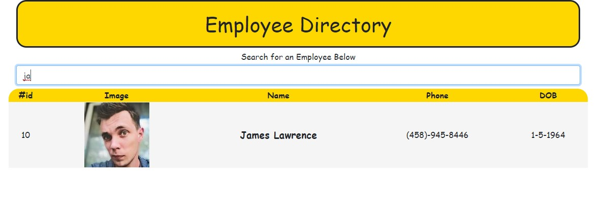

# Employee Directory&middot;  

## Deployed Site
Github Link : https://github.com/ChrisAMK/Employee-Directory

Deployed Site Link: https://chrisamk.github.io/Employee-Directory/

## Description 
This week's task was to create an Employee Directory that displayed a bunch of employees of a company, display their id, name, phone and date of birth. The application was built on React, React is handy in the way we can keep our application modulialized with components. Because of this we are able to combine programming with components to conditionally render components to create a quite interactive application. We had to learn about state and how it operates as a sort of memory inside a component, that way we can store variables and data to individual components.

## Table of Contents 
* [Installation](#Installation)
* [Usage](#Usage)
* [License](#License)
* [Contributions](#Contributions)
* [Tests and Examples](#Tests)
* [Questions](#Questions)

## Installation  
No Installation Required, use the deployed site provided Above

## Usage  
To be able to sort through a list of employees of a company

## License  
Academic Free License v3.0

[Click Here to go to License Site!](https://opensource.org/licenses/AFL-3.0)

## Tests and Examples  
Use the search bar to search for specific names, or use the sort functionality

## Questions  
If there are any questions feel free to reach me at [Github](https://github.com/ChrisAMK)

or E-mail me at chriskl@live.com

